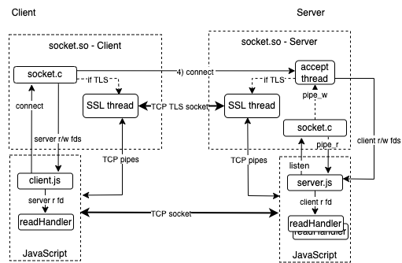

# net

client.mjs and server.mjs implement a TCP socket client and server, respectively.

## Socket Architecure


<p style="text-align: center;">socket architecture</p>

A socket server starts with JavaScript (JS) creating an instance of Server and calling its listen method. The C module creates a pipe whose write end is passed to an accept thread that loops waiting for client requests and the pipe's read end is returned to JS and used in os.setReadHandler.

Later, a client app creates an instance of Client and calls the connect method. If the connection uses TLS, the connect method creates a pair of read/write pipes. One set of pipe ends are passed to a client TLS thread that makes the request. Otherwise, the main C thread makes the request.  Then read/write fds are returned to JS, either for the server \(no TLS\) or the read/write pipes for the TLS thread.

The accept thread in the server accepts the request. If the connection uses TLS, the accept thread creates a pair of read/write pipes. One set of pipe ends are passed to a server TLS thread that accepts the request. Then read/write fds are sent to JS over the accept thread pipe, either for the client \(no TLS\) or the read/write pipe for the server TLS thread.

At this point, client and server JS applications are connected either by a socket \( no TLS \) or a pair of pipes \( TLS \) and send data using os.write(fd, ...) and receive data in their respective readHandlers.

## API
## socket.c
A quickjs C module exporting Client and Server classes for creating TCP sockets that may optionlly use TLS encryption.
```
import{ Client, Server } from 'socket.so'
```
### Client
#### Constructor

```
const client = new Client;
```

#### Methods

```
const fds = client.connect( { port \[ host \[ tls \] \] } )
```

- port: server port
- host: optional server hostname or ip address ( localhost if missing )
- tls: if true, use tls, unencrypted if missing or false
- Returns: an array with the server's read and write socket fds \[ read_fd, write_fd \].

The quickjs client application will use os.setReadHandler() with the socket's fds\[ 0 \] to asychronously wait for server socket data.

### Server
#### Constructor

```
const server = new Server( );
```

#### Methods

```
server.listen( { port \[, key, cert \] } )
```

- port: port to listen on for connects
- key, cert: if specified, they will be used for TLS, otherwise the socket will not use encrytpion
- Returns:
	- stop: function to end thread listening for connects
	- pipe_fd: pipe file descriptor to receive a client's socket fds \[read_fd, write_fd\].

The quickjs server application will use  os.setReadHandler() with the pipe_fd to asychronously wait for client socket fds when a client makes a connection request. os.setReadHandler is then used with the socket's fds\[0\] to asychronously wait for client socket data.

## Client/Server examples

### client.mjs

```
client port [host[tls]]
```
- port: port to connect to.
- host: optional host, IP address, URL or local hostname . Defaults to localhost.
- tls: optional flag to use TLS socket. Defaults to false.

### server.mjs

```
server port [tls]
```
- port: port to listen on.
- tls: optional flag to use TLS socket. Defaults to false.

### TLS Credentials
Using TLS requires a server private key and certificate named key.pem and cert.pem, respectively. A self-signed cert and key can be made using [mkcert](https://github.com/filosottile/mkcert). If a browser is used as a client, use

```
mkcert --install
```
to add the certificate to your system's trust store.

## Build

```
make [ client | server | socket.so | clean ]
```

client and server are standalone executables. client.js and server.js can be run directly using the shared module socket.so:

```
qjs server.js 8080&
qjs client.js 8080
```

These will execute correctly but client.js terminates with bus error 10. It has not been determined if this is a problem in qjs or a latent bug in client.js.

## License

Software license: Creative Commons Attribution-NonCommercial 4.0 International

**THIS SOFTWARE COMES WITHOUT ANY WARRANTY, TO THE EXTENT PERMITTED BY APPLICABLE LAW.**
